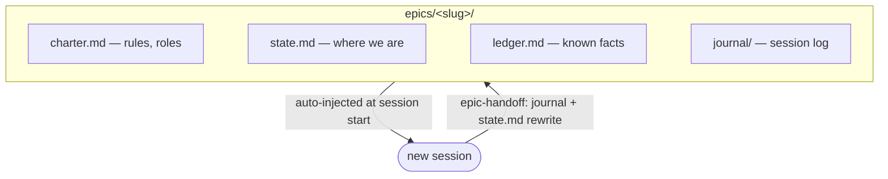
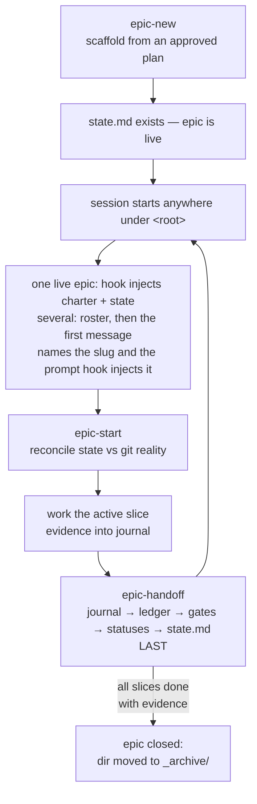

# epic-tree

Long-running AI work, rooted: charter, state, and evidence that survive every
session, agent, and compaction. Built for Claude Code (hook + skills), readable
by any agent via [AGENTS.md](https://agents.md).

[](https://github.com/den2207/epic-tree/actions/workflows/smoke.yml)
[](LICENSE)


> On the tree it was built for: **3.49M tokens** of accumulated epic context,
> reachable from a **~2.5k-token** session start. One epic ran **85 sessions**
> without a single hand-written handoff prompt.

## The problem

A big epic spans many chat sessions. Task trackers remember *what's left*, but every
new session still loses the **operational context**: which model runs which role,
permission boundaries, agreed approaches, known traps, and where the work actually
stands.

### Before

Every handoff is hand-written, and every session re-learns the epic from scratch:


### After

The epic lives in files with fixed roles; hooks inject them into every new session
automatically — the handoff prompt as a genre disappears:



Two physically separate context classes make this safe:

| class | files | lifecycle |
|---|---|---|
| stable operational layer | `charter.md`, `ledger.md` | written once / append-only; auto-injected every session |
| live state | `state.md` (overwrite-only), `journal/` (append-only per session) | rewritten at each handoff by a single writer |

With one live epic under the cwd, every session gets its full context at start. With
several, the session gets a roster (slug, last update, kickoff phrase — ~300 tokens),
and the user's first message selects the epic by naming its slug: a `UserPromptSubmit`
hook then injects that epic's full context. Selection is a mechanism, not a rule the
model has to remember.

## Measured on a real epic tree

The numbers below are counts from the tree this was built on and run against daily:
**23 epics, 534 sessions, 50 days**, one root spanning **11 repositories**. They are
that tree's own figures, not a benchmark.

### 1. Context survives the session — 56:1

| | measured |
|---|---|
| accumulated epic context (charter, plan, state, ledger, gates, journals) | **3.49M tokens** |
| injected into a new session so it knows where the work stands | **~2.5k tokens** |
| compression | **56:1** — best single epic **437:1** |
| longest-running epic | **85 sessions** |
| median epic | 18 sessions |

An 85-session epic is 85 times the context window died and the work had to resume
anyway. None of those resumes needed a hand-written kickoff prompt: the state is
already in the session before its first tool call.

### 2. A fact is proven once — 5.2× reuse

| | measured |
|---|---|
| stable facts declared in ledgers (`L-NN`) | **716** |
| references to them from state, plans and journals | **3 687** |
| average reuse per fact | **5.2×** |
| references to human-only gates (`G-NN`) outside the gate queue | 2 642 |

3 687 times a session cited a known blocker, a non-regression or a trap by ID
instead of re-deriving it from the code. Neither a task tracker nor a project-wide
`CLAUDE.md` can do this: neither gives an individual finding a stable ID that later
sessions can point at.

### 3. "Done" means evidence, not the model's word

| | measured |
|---|---|
| slices defined | **292** |
| closed | **243** |
| of those, citing a commit SHA or verify-command output | **200** |
| human-only gates queued, none silently dropped | **219** |

A slice cannot flip to `done` without a verify command's output or a commit hash in
its evidence column — the skill refuses. What the model believes it finished is not
the status.

## How this differs from what you already use

| | what it holds | what it leaves out |
|---|---|---|
| task tracker (Linear, Jira) | what's left to do | how to work: roles, permission boundaries, traps, evidence |
| `CLAUDE.md` / `AGENTS.md` | project-wide conventions | where *this* epic stands right now |
| per-repo memory-bank files | a context set read at task start | slice verification, human-gate queue, several live epics in parallel |
| spec-driven toolkits | the spec and task breakdown ahead of the code | what actually happened across sessions — evidence, gates, dead ends |
| a hand-written handoff prompt | whatever you remembered to type | everything you didn't |

## Anatomy of an epic

```
<root>/epics/
  _archive/<slug>/          # closed epics — moved here, no longer live
  <slug>/                   # live epic: any dir here with a state.md
    charter.md              # non-negotiables, roles (agent/model/effort), repo topology
    plan.md                 # slice table: S-NN | slice | verify | status | evidence
    state.md                # where we are; coordinator-only, max 40 lines
    ledger.md               # L-NN stable facts: known blockers, non-regressions, gotchas
    gated-actions.md        # G-NN queue of human-only actions (open + this session's)
    gated-actions.ARCHIVE.md# closed G-NN blocks, moved here at handoff
    journal/                # <date>-<HHMM>-<role>.md, one per session
```

`<root>` is the directory spanning every repo the epic touches — typically a group
dir containing several repos. The hooks resolve it from any cwd: linked git worktrees
map back to their main checkout, then a walk-up collects every `epics/` dir above
(never considering `$HOME` itself). There is no pointer file: a directory with a
`state.md` is live, a directory under `_archive/` is closed.

`epics/` is deliberately visible and vendor-neutral — not a `.claude/` or tool-named
dot-dir. These files are project content that humans and every agent read each
session, so they follow the visible-content convention of Spec Kit's `specs/` and
Cline's `memory-bank/` rather than the hidden tool-internals pattern. Epics created
under the legacy `.claude/epics/` path keep working — the hook falls back to it.

## Session lifecycle



- **epic-new** — scaffold an epic from an approved plan; refuses to finish without a
  verify command per slice and a roles/model table.
- **epic-start** — session kickoff: reconcile injected state against `git` reality
  across ALL topology repos, detect dead sessions (commits without journal entries),
  confirm role and nearest stop-gate.
- **epic-handoff** — session close: journal first, ledger/gates/statuses next
  (coordinator only), `state.md` rewritten LAST as the crash-safe commit marker,
  including a `## Map` — a cheap ASCII picture of every slice (done / in progress /
  blocked / todo) with one `<- NEXT` marker and an `After:` line — and a concrete
  `kickoff:` phrase. The closing chat message repeats the map and ends with one
  sentence: which directory to open the next chat in and what to paste as its first
  message — it names the slug and next step, so chat titles stop being generic.

## Multiple epics

Any number of epics can be live under one root — a group-wide one, a repo-scoped one
and a third for a sub-group repo all sit in the same `epics/` dir and differ only in
their charter topology. Nothing is shared between them, so parallel sessions on
different epics never race. Per session the selection goes:

```
epics/                          new chat, cwd anywhere under <root>
  payments/   state.md            │ SessionStart: 3 live → roster (slug · updated · kickoff)
  icons/      state.md            │ user pastes:  "epic icons: S-3 export pipeline"
  onboarding/ state.md            │ UserPromptSubmit: names `icons` → inject icons' charter + state
  _archive/legacy-cleanup/        ▼ epic-start, work, epic-handoff → state.md + kickoff for next time
```

A message naming two slugs injects nothing and asks for one; a message naming none
means the session is not epic work. Nested `<repo>/epics/` dirs are merged into the
roster of sessions below them, but one `epics/` at the group root keeps the roster in
one place. `EPIC_TREE_ROOT=<dir>` forces a specific root from any cwd.

Visibility: `bin/epic-list.sh [root…]` prints every live epic below a root with its
last update, kickoff phrase and active step, and flags stray v1 `ACTIVE` files.

## Design rules that earn their keep

- **Single writer**: only the coordinator rewrites `state.md`; executors write their
  own journal file and propose changes there.
- **Evidence discipline**: a slice status flips to `done` only with a verify-command
  output or commit hash in the `evidence` column.
- **Ledger over re-proving**: known blockers and non-regressions get an `L-NN` ID once
  and are referenced, not re-derived, by later sessions.
- **Tool-agnostic files, Claude Code adapters**: the epic files are plain
  markdown with fixed sections, stable IDs, and a `contract:` line each — any AI agent
  can consume them. The hook and the three skills are the *Claude Code adapter*;
  non-Claude agents (Codex, Cursor, Copilot CLI, …) self-discover the epic via the
  generated `AGENTS.md` at the epic root ([the cross-tool standard](https://agents.md)),
  which carries the bootstrap: read charter Non-negotiables verbatim, read state +
  active slice, create your own journal file, respect the write discipline of your
  role. The generated content sits inside `BEGIN/END epic-tree adapter` markers,
  so regeneration replaces only its own block and hand-written AGENTS.md content
  survives. Because those tools stop AGENTS.md discovery at a repo's own git root
  (and a group root is usually not a git repo), `epic-new` also drops an untracked
  stub `AGENTS.md` into each member repo that has none (kept out of git via
  `.git/info/exclude`), pointing one level up. Orchestrators additionally embed
  the Non-negotiables block in every executor prompt regardless of tool.

## Install

```bash
git clone https://github.com/den2207/epic-tree.git ~/epic-tree && ~/epic-tree/install.sh
```

Idempotent: links the skills, registers both hooks, runs the smoke suite. Details and
the manual path: [install.md](install.md). Rationale and the review that shaped the
design: [docs/design.md](docs/design.md).

## Testing

```bash
bash tests/smoke.sh
```

Sixteen hermetic scenarios (temp-dir fixtures, no setup): single-epic injection from
the root and from a repo below it, `_archive/` exclusion, roster order and kickoff
lines, prompt selection (one slug, none, several, whole-word matching), UTF-8-safe
truncation of an oversized charter, nested `epics/` merging, stale v1 `ACTIVE`
flagging, the `EPIC_TREE_ROOT` override, and `epic-list`. Run it after any change
under `hooks/`.

## Limitations

- **Claude Code is the only first-class adapter.** Other agents read the same files
  through `AGENTS.md`, but nothing injects context for them automatically — they
  have to be pointed at the epic root.
- **Write discipline is prose, not code.** The single-writer and evidence rules live
  in skill instructions; a model that ignores them corrupts `state.md` and only a
  later `epic-start` reconcile catches it. The MCP server below is the fix.
- **No concurrency control.** Two sessions on the *same* epic can both rewrite
  `state.md`; the convention is one live session per epic, unenforced.
- **Markdown tables are the schema.** Fixed columns and stable IDs, parsed by grep —
  robust enough in practice, but a malformed row degrades silently.

## Roadmap

A local MCP server exposing `get_active_slice` / `record_evidence` / `next_gate`
would turn the write discipline from prose rules into code-enforced tools for any
MCP-capable agent — see the ecosystem sweep in [docs/design.md](docs/design.md).

## License

MIT
