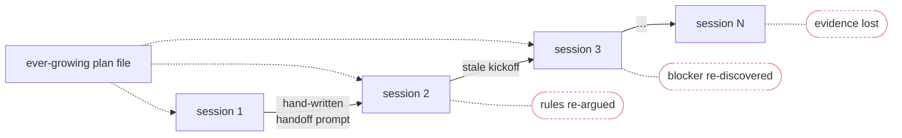
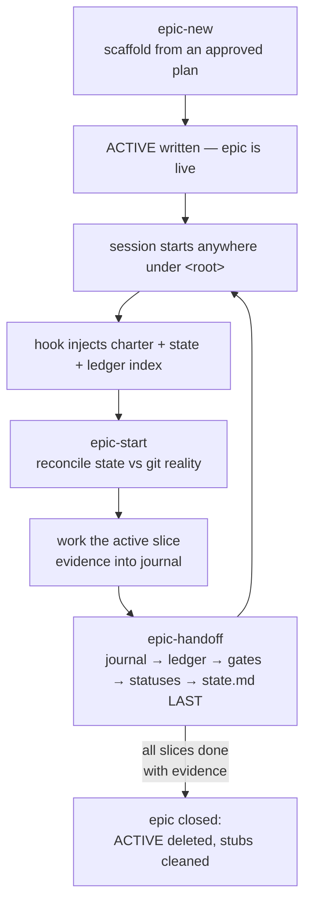

# epic-tree

Long-running AI work, rooted: charter, state, and evidence that survive every
session, agent, and compaction. Built for Claude Code (hook + skills), readable
by any agent via [AGENTS.md](https://agents.md).

## The problem

A big epic spans many chat sessions. Task trackers remember *what's left*, but every
new session still loses the **operational context**: which model runs which role,
permission boundaries, agreed approaches, known traps, and where the work actually
stands.

### Before

Every handoff is hand-written, and every session re-learns the epic from scratch:



### After

The epic lives in files with fixed roles; a `SessionStart` hook injects them into
every new session automatically — the handoff prompt as a genre disappears:


Two physically separate context classes make this safe:

| class | files | lifecycle |
|---|---|---|
| stable operational layer | `charter.md`, `ledger.md` | written once / append-only; auto-injected every session |
| live state | `state.md` (overwrite-only), `journal/` (append-only per session) | rewritten at each handoff by a single writer |

Sessions at the epic root get the full context; sessions inside a member repo get a
one-line banner only (most of them are unrelated to the epic — the banner costs ~50
tokens instead of ~2.5k), and `epic-start` reads the full files when the session
actually works on the epic.

## Anatomy of an epic

```
<root>/epics/
  ACTIVE                    # first line: slug; then one repo name per line
  <slug>/
    charter.md              # non-negotiables, roles (agent/model/effort), repo topology
    plan.md                 # slice table: S-NN | slice | verify | status | evidence
    state.md                # where we are; coordinator-only, max 40 lines
    ledger.md               # L-NN stable facts: known blockers, non-regressions, gotchas
    gated-actions.md        # G-NN queue of human-only actions (open + this session's)
    gated-actions.ARCHIVE.md# closed G-NN blocks, moved here at handoff
    journal/                # <date>-<HHMM>-<role>.md, one per session
```

`<root>` is the directory spanning every repo the epic touches — typically a group
dir containing several repos. The hook resolves it from any cwd: linked git worktrees
map back to their main checkout, then a walk-up finds the nearest `ACTIVE`
(never considering `$HOME` itself). Sessions in repos the epic doesn't list are left
untouched.

`epics/` is deliberately visible and vendor-neutral — not a `.claude/` or tool-named
dot-dir. These files are project content that humans and every agent read each
session, so they follow the visible-content convention of Spec Kit's `specs/` and
Cline's `memory-bank/` rather than the hidden tool-internals pattern. Epics created
under the legacy `.claude/epics/` path keep working — the hook falls back to it.

## Session lifecycle



- **epic-new** — scaffold an epic from an approved plan; refuses to finish without a
  verify command per slice and a roles/model table.
- **epic-start** — session kickoff: reconcile injected state against `git` reality
  across ALL topology repos, detect dead sessions (commits without journal entries),
  confirm role and nearest stop-gate.
- **epic-handoff** — session close: journal first, ledger/gates/statuses next
  (coordinator only), `state.md` rewritten LAST as the crash-safe commit marker,
  including a concrete `kickoff:` line the human pastes to open the next session —
  it names the slug and next step, so chat titles stop being generic.

## Multiple epics

One `ACTIVE` — one active epic per root; the hook injects exactly one context per
session. Ways to run several epics concurrently:

- **Different groups** — fully independent; each root has its own `epics/ACTIVE`.
- **Group + repo** — the nearest `ACTIVE` wins on the walk-up, so a repo-scoped epic
  (`<repo>/epics/ACTIVE`) can run inside a group that has its own group-level epic:
  sessions in that repo get the repo epic, the rest of the group gets the group epic.
- **Per-terminal override** — `EPIC_TREE_ROOT=<dir>` forces a specific root (and
  skips the membership gate).

```
<group>/
  epics/ACTIVE          # "payments" — group-wide epic
  repo-a/               # listed in ACTIVE → sessions here get payments
  repo-b/
    epics/ACTIVE        # "icons" — repo-scoped epic; wins here (nearest ACTIVE)
```

Visibility: `bin/epic-list.sh [root…]` prints every epic below a root with its
active step and flags shadowing; the session banner of a nested epic carries a
`shadows epic '<slug>' @ <root>` note, so a forgotten repo-level `ACTIVE` cannot
silently hide a group epic.

Two epics sharing the same repo at the same level are deliberately unsupported: one
session gets one charter (the 9k injection budget) and one single-writer state.

## Design rules that earn their keep

- **Single writer**: only the coordinator rewrites `state.md`; executors write their
  own journal file and propose changes there.
- **Evidence discipline**: a slice status flips to `done` only with a verify-command
  output or commit hash in the `evidence` column.
- **Ledger over re-proving**: known blockers and non-regressions get an `L-NN` ID once
  and are referenced, not re-derived, by later sessions.
- **Tool-agnostic files, Claude Code adapters**: the epic files are plain
  markdown with fixed sections, stable IDs, and a `contract:` line each — any AI agent
  can consume them. The hook and the three skills are the *Claude Code adapter*;
  non-Claude agents (Codex, Cursor, Copilot CLI, …) self-discover the epic via the
  generated `AGENTS.md` at the epic root ([the cross-tool standard](https://agents.md)),
  which carries the bootstrap: read charter Non-negotiables verbatim, read state +
  active slice, create your own journal file, respect the write discipline of your
  role. The generated content sits inside `BEGIN/END epic-tree adapter` markers,
  so regeneration replaces only its own block and hand-written AGENTS.md content
  survives. Because those tools stop AGENTS.md discovery at a repo's own git root
  (and a group root is usually not a git repo), `epic-new` also drops an untracked
  stub `AGENTS.md` into each member repo that has none (kept out of git via
  `.git/info/exclude`), pointing one level up. Orchestrators additionally embed
  the Non-negotiables block in every executor prompt regardless of tool.

## Testing

```bash
bash tests/smoke.sh
```

Nine hermetic scenarios (temp-dir fixtures, no setup): full injection at the epic
root, member-repo banner, membership gate, CRLF `ACTIVE`, slug traversal guard,
UTF-8-safe truncation of an oversized charter, nested-epic shadowing, and the
`EPIC_TREE_ROOT` override. Run it after any change to `hooks/session-start.sh`.

## Install

```bash
git clone https://github.com/den2207/epic-tree.git ~/epic-tree && ~/epic-tree/install.sh
```

Idempotent: links the skills, registers the hook, runs the smoke suite. Details and
the manual path: [install.md](install.md). Rationale and the review that shaped the
design: [docs/design.md](docs/design.md).

## Roadmap

A local MCP server exposing `get_active_slice` / `record_evidence` / `next_gate`
would turn the write discipline from prose rules into code-enforced tools for any
MCP-capable agent — see the ecosystem sweep in [docs/design.md](docs/design.md).

## License

MIT
